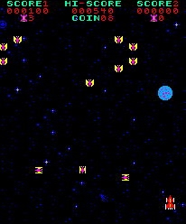
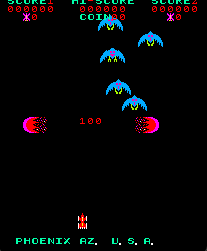

# Phoenix Emulator

A simple emulator for the classic **1980 Phoenix** arcade game, written in C. This project simulates the original game's hardware, including CPU emulation, memory mapping, and audio handling.

## Features

- Full and accurate emulation of the Intel 8085 CPU.
- Memory and I/O mapping based on the original hardware
- Basic audio support
- Using SDL2 for graphics and sound

## Controls

| Key | Action |
|----------|----------|
| ← / →   | Move left/right|
| C  | Insert coin   |
| X  | Activate Shield |
| Space | Shoot |
| Enter | Start Game|

## Examples

 